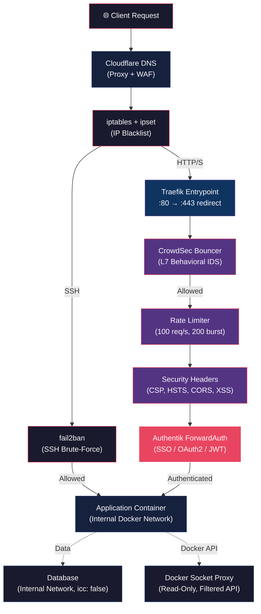

# BB Ansible — Ansible Server Provisioning

Automated provisioning for BB Ansible share & appbox nodes on Hetzner.  
Inspired by [Saltbox](https://docs.saltbox.dev/) — curl, configure, install.

## Node Architecture (The 3 Classes)

BB Ansible is a distributed, multi-tenant ecosystem. It does not run on a single monolithic server. Instead, roles are mathematically split across three distinct classes of nodes, all tied together by a central Ceph storage fabric.

### 1. The Service Node (`node_type: service`)
*   **The Brain of the Cluster:** This is your primary control plane. You typically only need **one** service node in your entire cluster.
*   **What it runs:** Single Sign-On (Authentik), Global Reverse Proxy (Traefik), AI/LLM interfaces (Open WebUI), secure file drop mechanisms (Enclosed), and central monitoring agents (Beszel Hub).
*   **Storage Access:** Needs access to the global Ceph filesystem (`/bbfs`) strictly for database backups.
*   **Hardware Tier:** Low/Medium (4 Cores, 8GB RAM). Highly dependent on Authentik load and whether you run AI models locally. 

### 2. The Feeder Node (`node_type: feeder`)
*   **The Ingestion Engine:** This node is responsible for finding, downloading, unpacking, and organizing media. It does the heavy lifting of pirating content.
*   **What it runs:** The entire *Arr ecosystem (Sonarr, Radarr, Prowlarr, etc.), download clients (qBittorrent, SABnzbd, Cross-Seed), and ecosystem managers (Autoscan).
*   **Storage Access:** Needs massive, high-speed read/write access to the Ceph `/data` and `/media` mounts to dump newly acquired files.
*   **Hardware Tier:** Medium/High (8 Cores, 16GB+ RAM, fast local NVMe cache). 

### 3. The Media Node (`node_type: share` or `appbox`)
*   **The Delivery Edge:** This is what your users connect to. You can horizontally scale these infinitely (e.g., `user01-appbox`, `public-share-03`).
*   **What it runs:** Media servers (Plex, Emby, Jellyfin), VPN tunnels (Gluetun), and edge-based Autoscan targets.
*   **Storage Access:** Strictly **Read-Only** access to the Ceph `/media` mount. This insulates your core library from users accidentally deleting files via an Emby client bug. It gets read/write access to its own isolated application folder on the array.
*   **Hardware Tier:** High (8+ Cores, QuickSync/GPU for transcoding, 10Gbps networking).

---

## Step-by-Step Cluster Deployment

When building a fresh BB cluster from scratch, you must provision the nodes in a specific mathematical order so the identity matrix bootstraps cleanly. 

### Step 1: Pre-Flight Credentials
Because BB is designed for zero-touch deployments, you must define your cluster's identities and API keys in a `.env` file *before* executing the installer. The installer will automatically detect it and inject these into the cluster.

1. Download the sample template to your root directory:
   ```bash
   curl -sO https://raw.githubusercontent.com/LunarVigilante/bb_ansible/main/.env.sample
   mv .env.sample .env
   ```
2. Open the file in a text editor:
   ```bash
   nano .env
   ```
3. Fill in the required variables. **(Do NOT use quotes around your values in the `.env` file.)**
   *   `BB_NODE_TYPE=service`                      *(Required: Set this to service for the first node)*
   *   `BB_ADMIN_PASSWORD=your_secure_password`    *(Required: The master password you want for your cluster dashboard)*
   *   `BB_CF_EMAIL=you@example.com`               *(Required: Cloudflare email for SSL certs)*
   *   `BB_CF_API_TOKEN=your_token`                *(Required: Cloudflare API Token for Traefik DNS-01 validation. Create this in the Cloudflare Dashboard under My Profile -> API Tokens -> Custom Token -> Permissions: Zone / DNS / Edit)*
   *   `BB_CEPH_DASHBOARD_URL=https://ceph:8443`   *(Required: The URL of your centralized Ceph dashboard)*
   *   `BB_CEPH_DASHBOARD_USER=admin`              *(Required: Ceph admin username)*
   *   `BB_CEPH_DASHBOARD_PASSWORD=ceph_pass`      *(Required: Ceph admin password)*
   *   *(Fill in any other optional API keys you have, such as Discord webhooks or Media APIs. See `accounts.yml.default` for explanations).*
4. Save and exit (`Ctrl+O`, `Enter`, `Ctrl+X`).
*(Note: Keep this `.env` file handy. You will securely copy it to the other nodes before you bootstrap them.)*

### Step 2: Provision the Service Node
You must establish the identity core (Authentik) first, as all other nodes will eventually route their subdomains to it.

1. Install a fresh OS (Debian/Arch) on your Service hardware.
2. Ensure your properly configured `.env` file is present in your current directory. 
3. Become root and run the bootstrap installer:
   ```bash
   curl -sL https://raw.githubusercontent.com/LunarVigilante/bb_ansible/main/install.sh | sudo bash
   ```
4. Execute the deployment:
   ```bash
   cd /srv/git/blackbeard
   bb install node
   ```
5. Log into your new Authentik dashboard (e.g. `https://sso.yourdomain.com`) using the auto-generated Postgres and JWT passwords outputted by the log (or defined in your `.env`), and establish your core user identity.

### Step 3: Provision the Feeder Node
Now that SSO is online, spin up the download engine.

1. Boot the Feeder hardware.
2. Securely copy your `.env` file from the Service node over to this node's root directory.
3. Edit the `.env` file and change the node type:
   ```bash
   nano .env
   # Change to: BB_NODE_TYPE=feeder
   ```
4. Become root and run the bootstrap installer:
   ```bash
   curl -sL https://raw.githubusercontent.com/LunarVigilante/bb_ansible/main/install.sh | sudo bash
   ```
5. Deploy the stack: 
   ```bash
   cd /srv/git/blackbeard
   bb install node
   ```
6. The system will automatically acquire its Ceph keyring, mount the unified `/data` arrays, deploy the *Arr stack, and hook its web dashboards into the Traefik router on the Service node.

### Step 4: Provision Media Nodes (Appboxes/Shares)
Finally, generate edge nodes for users to consume the media.

1. Boot the Media hardware (preferably with a GPU/QuickSync).
2. Securely copy your `.env` file from the Service node over to this node's root directory.
3. Edit the `.env` file to set the edge parameters:
   ```bash
   nano .env
   # Change to: BB_NODE_TYPE=appbox   (or share)
   # Change to: BB_MEDIA_SERVICE=plex (or emby, jellyfin)
   ```
4. Become root and run the bootstrap installer:
   ```bash
   curl -sL https://raw.githubusercontent.com/LunarVigilante/bb_ansible/main/install.sh | sudo bash
   ```
5. Deploy the stack:
   ```bash
   cd /srv/git/blackbeard
   bb install node
   ```
6. The media node will mount the Ceph `/media` array strictly as **Read-Only** to protect your library, dynamically request an ingress certificate from Cloudflare, and spin up the designated streaming container.

## Security

### Data Flow — Request Journey Through the Security Stack



### Network Security

| Layer | Control | Details |
|-------|---------|---------|
| **Edge** | Cloudflare DNS Proxy | WAF + DDoS mitigation at edge |
| **L3/L4** | `ipset_blacklist` | Weekly-updated IP blacklist via systemd timer |
| **L4** | `fail2ban` | SSH: aggressive mode, 3 retries, 1h ban + recidive (3 bans = 1 week) |
| **L7** | CrowdSec | Behavioral IDS with community blocklists + Traefik bouncer |
| **L7** | Traefik Rate Limiter | 100 req/s average, 200 burst globally on all entrypoints |
| **Docker** | `icc: false` | Inter-container communication disabled by default |
| **Docker** | Internal networks | All databases isolated on `internal: true` Docker networks |
| **Docker** | Socket proxy | Read-only Docker API via `tecnativa/docker-socket-proxy` |

### Authentication & Access Control

| Control | Implementation |
|---------|---------------|
| **SSO** | Authentik ForwardAuth via Traefik (OAuth2/OIDC) |
| **Session** | 8-hour max duration, explicit timeout enforcement |
| **MFA** | Authentik supports TOTP + WebAuthn (manual enforcement in admin UI) |
| **OS passwords** | SHA-512 with dynamic host-seeded salts |
| **Lockout** | fail2ban SSH + Authentik built-in rate limiting |
| **SSH alerting** | PAM-triggered Discord webhook on every successful login |

### Credential Security

| Control | Implementation |
|---------|---------------|
| **Auto-generation** | All blank/`CHANGE_ME` passwords auto-generated via `openssl rand -hex 16` |
| **Min length** | User-supplied passwords < 8 chars are overridden with secure random |
| **File permissions** | `accounts.yml` and `settings.yml` locked to `0600` on creation |
| **Ansible logging** | `no_log: true` on all sensitive template deployments |
| **Telemetry** | Authentik Sentry error reporting disabled; Traefik anonymous usage disabled |
| **Git safety** | `.gitignore` covers `.env`, vault files, SSH keys, ACME certs, TLS keys |
| **CI scanning** | Gitleaks scans every push/PR for leaked API keys and secrets |

### Container Hardening

| Control | Implementation |
|---------|---------------|
| **Privilege escalation** | `no-new-privileges: true` in Docker daemon |
| **Userland proxy** | Disabled (`userland-proxy: false`) — uses iptables hairpin NAT |
| **Log rotation** | `json-file` driver, `10m` max size, `3` file retention |
| **QoS isolation** | All containers in `kronos.slice` cgroup with `CPUWeight=50`, `IOWeight=50` |
| **Port binding** | Authentik ports bound to `127.0.0.1` (unreachable externally) |

### API & Client-Side Protection

| Control | Implementation |
|---------|---------------|
| **TLS** | Let's Encrypt via Cloudflare DNS-01 challenge, TLS 1.2 minimum |
| **HSTS** | 1 year + subdomains + preload |
| **CSP** | `default-src 'self'`, `script-src 'self'`, `object-src 'none'`, `upgrade-insecure-requests` |
| **CORS** | `Cross-Origin-Opener-Policy: same-origin`, `Cross-Origin-Resource-Policy: same-origin` |
| **Permissions** | Camera, mic, geolocation, payment, USB, sensors all disabled |
| **Headers** | `X-Frame-Options: DENY`, `X-Content-Type-Options: nosniff`, `X-XSS-Protection: 1` |
| **Server info** | `X-Powered-By` and `Server` headers stripped |

### Input Validation

| Control | Implementation |
|---------|---------------|
| **Shell hardening** | `set -euo pipefail` on all scripts |
| **Sed injection** | Pipe characters escaped in `set_val()` before sed substitution |
| **Node type** | Enum validation: `share`, `appbox`, `baremetal`, `service`, `feeder` |
| **Domain format** | FQDN regex validation for `base_domain` before deployment |

### Monitoring & Alerting

| Alert | Channel | Trigger |
|-------|---------|---------|
| SSH login | Discord | Every successful SSH authentication via PAM hook |
| Brute-force ban | fail2ban log | 3 failed SSH attempts |
| Container update | Dockwatch UI | New image version available |
| VPN tunnel restart | Discord | Gluetun container die/restart event |
| L7 threat | CrowdSec | Behavioral anomaly detection |

### CI/CD Security Pipeline

| Workflow | Purpose |
|----------|---------|
| `gitleaks.yml` | Scans every push/PR for leaked API keys, passwords, and secrets |
| `ansible-lint.yml` | SAST: runs `ansible-lint --strict` on all YAML/Jinja2 changes |

### Security CLI Commands

| Command | Purpose |
|---------|---------|
| `bb validate` | Pre-flight: Ansible syntax check + `--check --diff` dry-run |
| `bb audit` | Scans for CHANGE_ME placeholders, weak file permissions, Docker socket exposure, and debug log levels |
| `bb deps` | Live SBOM: lists all container images with tag status + Ansible Galaxy collections |

## Post-Install

After `bb install node` completes:
1. SSH as admin: `ssh admin@NODE_IP`
2. Verify config: `bb status`
3. Run security audit: `bb audit`
4. Run health check: `bb health`
5. Containers are deployed automatically via Docker Compose (Traefik, Gluetun, Autoscan)
6. (Plex) Copy `.ovpn` file: `cp your-vpn.ovpn /opt/gluetun/config.conf && cd /opt/gluetun && docker compose up -d`
7. Accept CrowdSec enrollment at [app.crowdsec.net](https://app.crowdsec.net)


## Available Tags

### Groups

| Tag | Components |
|-----|-----------|
| `core` | base, users, packages, ssh, tcp, lvm, ethtool |
| `node` | All 17 roles |

### Individual

| Tag | Description | Conditional |
|-----|-------------|-------------|
| `base` | Hostname, dotfiles, NTP, timezone, locale | — |
| `users` | Admin user, SSH keys, sudoers | — |
| `packages` | pacman/apt, yay, AUR, smartmontools, stress-ng, jq, etc. | — |
| `ssh` | SSH hardening (modern ciphers, MaxAuthTries 3, idle timeout) + fail2ban (aggressive + recidive) | — |
| `tcp` | TCP/sysctl tuning optimized for Ceph + media streaming (BBR, conditional 10G/1G buffers) | — |
| `lvm` | Extend LVM + XFS | `secondary_drive != none` |
| `ethtool` | NIC ring buffer optimization (auto-detects max for 1G and 10G) | — |
| `ceph` | Ceph config + API user + mounts (tuned for streaming readahead) | — |
| `docker` | Docker 28.5.2 (pinned), daemon.json, all networks, Portainer agent, autoheal | — |
| `crowdsec` | CrowdSec IDS + Traefik bouncer | — |
| `dockwatch` | Docker image update notifier / web UI | — |
| `beszel` | Lightweight server monitoring agent (8MB RAM) | needs `beszel_hub_key` |
| `ipset` | IP blacklist timer | — |
| `traefik` | Traefik reverse proxy via Docker Compose + Cloudflare ACME | — |
| `autoscan` | Autoscan media scanner via Docker Compose | `node_type: share` |
| `gluetun` | Gluetun VPN via Docker Compose | `media_service: plex` |
| `finishing` | Auth files, deployments | — |

## Configuration Files

### `accounts.yml` — Credentials

```yaml
admin_password: "your_secure_password"
ceph_dashboard_url: "https://ceph:8443"
ceph_dashboard_user: "admin"
ceph_dashboard_password: "ceph_pass"
cf_email: "you@example.com"
cf_auth_key: "cloudflare_global_key"
cf_api_token: "cloudflare_api_token"
musics_api_key: "music_key"
autoscan_password: ""           # leave blank to auto-generate
crowdsec_enroll_key: ""         # free at app.crowdsec.net
dockwatch_discord_webhook: ""     # Discord webhook for image updates
beszel_hub_key: ""              # from Beszel Hub → Add System
```

### `settings.yml` — Node Settings

```yaml
node_name: "e-ab-sm-01"
media_service: "emby"       # emby / plex / jellyfin
node_type: "appbox"         # share / appbox / baremetal
is_10g_node: false
secondary_drive: "none"     # or /dev/nvme1n1
emby_tier: "skip"           # appbox / basic / skip
```

## Project Structure

```
/srv/git/blackbeard/
├── install.sh              # Bootstrap script (curl target)
├── bb                      # CLI wrapper → /usr/local/bin/bb
├── ansible.cfg             # Self-provisioning config
├── setup.yml               # Main playbook
├── accounts.yml.default    # Credentials template
├── settings.yml.default    # Settings template
├── group_vars/all.yml      # Shared defaults (versions, networks, tuning)
└── roles/                  # 17 modular roles
    ├── base/               # hostname, dotfiles, NTP, locale, sudo
    ├── users/              # admin user, SSH keys
    ├── packages/           # system packages, yay, AUR
    ├── ssh_hardening/      # sshd (modern ciphers, banner), fail2ban (aggressive + recidive)
    ├── tcp_tuning/         # sysctl for Ceph + streaming (BBR, 10G/1G buffers, VM tuning)
    ├── lvm_extend/         # LVM + XFS grow
    ├── ethtool_buffer/     # NIC ring buffer (auto-detect max, all nodes)
    ├── ceph_client/        # Ceph REST API + mounts (8MB readahead, OSD tuning)
    ├── docker/             # Docker 28.5.2 (pinned), daemon.json, all networks, Portainer, autoheal
    ├── crowdsec/           # CrowdSec IDS + Traefik bouncer
    ├── dockwatch/          # Web-based autonomous container updater
    ├── beszel/             # Lightweight server monitoring agent
    ├── ipset_blacklist/    # IP blacklist timer
    ├── traefik/            # Traefik reverse proxy (Docker Compose + Cloudflare ACME)
    ├── autoscan/           # Media scanner (Docker Compose, share nodes)
    ├── gluetun/            # VPN (Docker Compose, Plex nodes)
    └── finishing/          # Auth files, deployments
```

## Security

- **SSH:** Modern ciphers only (no CBC/SHA1), MaxAuthTries 3, idle timeout 10min, login banner, VERBOSE logging
- **fail2ban:** Aggressive sshd mode + recidive jail (3 bans in 24h = 1 week ban on all ports)
- **CrowdSec:** Proactive IP blocking with community blocklists + Traefik bouncer
- **Docker:** Version pinned, log rotation, live-restore enabled

## Post-Install

After `bb install node` completes:
1. SSH as admin: `ssh admin@NODE_IP`
2. Verify config: `bb status`
3. Run health check: `bb health`
4. Containers are deployed automatically via Docker Compose (Traefik, Gluetun, Autoscan)
5. Portainer dashboard: `NODE_IP:9001` (monitoring only — deployment is handled by Ansible)
6. (Plex) Copy `.ovpn` file: `cp your-vpn.ovpn /opt/gluetun/config.conf && cd /opt/gluetun && docker compose up -d`
7. Accept CrowdSec enrollment at [app.crowdsec.net](https://app.crowdsec.net)
    